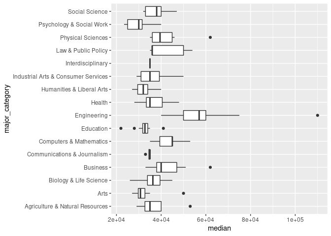
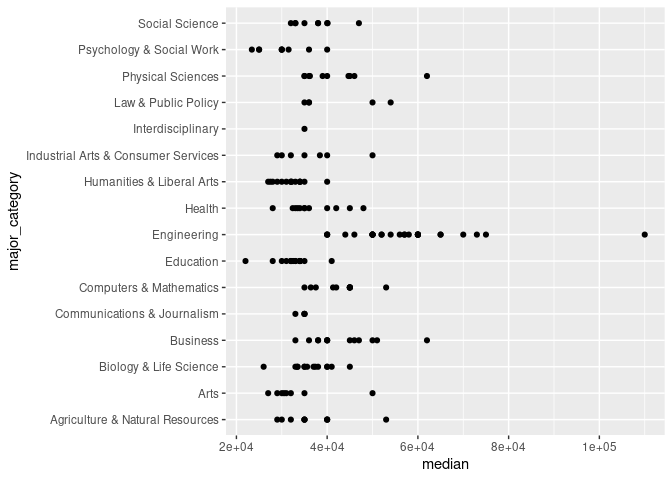

Activity 5
================
Name

## Data and packages

Again, we will load all of the `{tidyverse}` for this Activity.

``` r
library(tidyverse)
```

We continue our exploration of college majors and earnings from the data
behind the FiveThirtyEight story [The Economic Guide To Picking A
College
Major](https://fivethirtyeight.com/features/the-economic-guide-to-picking-a-college-major/).
Remember that there are many considerations that go into picking a
major. Earning potential and employment prospects are two (important) of
these considerations, but they do not tell the entire story.

We read in the same data from Activity 4 below, but notice that this
code is now surrounded in parentheses.

``` r
(college_recent_grads <- read_csv("data/recent-grads.csv"))
```

    ## # A tibble: 173 x 21
    ##     rank major_code major           major_category total sample_size   men women
    ##    <dbl>      <dbl> <chr>           <chr>          <dbl>       <dbl> <dbl> <dbl>
    ##  1     1       2419 Petroleum Engi… Engineering     2339          36  2057   282
    ##  2     2       2416 Mining And Min… Engineering      756           7   679    77
    ##  3     3       2415 Metallurgical … Engineering      856           3   725   131
    ##  4     4       2417 Naval Architec… Engineering     1258          16  1123   135
    ##  5     5       2405 Chemical Engin… Engineering    32260         289 21239 11021
    ##  6     6       2418 Nuclear Engine… Engineering     2573          17  2200   373
    ##  7     7       6202 Actuarial Scie… Business        3777          51  2110  1667
    ##  8     8       5001 Astronomy And … Physical Scie…  1792          10   832   960
    ##  9     9       2414 Mechanical Eng… Engineering    91227        1029 80320 10907
    ## 10    10       2408 Electrical Eng… Engineering    81527         631 65511 16016
    ## # … with 163 more rows, and 13 more variables: sharewomen <dbl>,
    ## #   employed <dbl>, employed_fulltime <dbl>, employed_parttime <dbl>,
    ## #   employed_fulltime_yearround <dbl>, unemployed <dbl>,
    ## #   unemployment_rate <dbl>, p25th <dbl>, median <dbl>, p75th <dbl>,
    ## #   college_jobs <dbl>, non_college_jobs <dbl>, low_wage_jobs <dbl>

Compare this code output to the `load_data` chunk in your knitted
Activity 4 `.md` report. What does enclosing an assignment code (i.e.,
`object_name <- r_code`) in parentheses do?

**Response**: It assigns a value to the object so R can keep track of it
and call it up in the environment.

### Data Codebook

Descriptions of the variables are again provided below. Again note that
the ACS only asks [one
question](https://www.census.gov/acs/www/about/why-we-ask-each-question/sex/)
about a person’s sexual identity.

| Header                         | Description                                                                 |
|:-------------------------------|:----------------------------------------------------------------------------|
| `rank`                         | Rank by median earnings                                                     |
| `major_code`                   | Major code, FO1DP in ACS PUMS                                               |
| `major`                        | Major description                                                           |
| `major_category`               | Category of major from Carnevale et al                                      |
| `total`                        | Total number of people with major                                           |
| `sample_size`                  | Sample size (unweighted) of full-time, year-round ONLY (used for earnings)  |
| `men`                          | Male graduates                                                              |
| `women`                        | Female graduates                                                            |
| `sharewomen`                   | Women as share of total                                                     |
| `employed`                     | Number employed (ESR == 1 or 2)                                             |
| `employed_full_time`           | Employed 35 hours or more                                                   |
| `employed_part_time`           | Employed less than 35 hours                                                 |
| `employed_full_time_yearround` | Employed at least 50 weeks (WKW == 1) and at least 35 hours (WKHP &gt;= 35) |
| `unemployed`                   | Number unemployed (ESR == 3)                                                |
| `unemployment_rate`            | Unemployed / (Unemployed + Employed)                                        |
| `median`                       | Median earnings of full-time, year-round workers                            |
| `p25th`                        | 25th percentile of earnings                                                 |
| `p75th`                        | 75th percentile of earnings                                                 |
| `college_jobs`                 | Number with job requiring a college degree                                  |
| `non_college_jobs`             | Number with job not requiring a college degree                              |
| `low_wage_jobs`                | Number in low-wage service jobs                                             |

The questions we will answer in this activity are:

-   How do the distributions of median income compare across major
    categories?
-   Do women tend to choose majors with lower or higher earnings?

## Analysis

### Median Earnings Description

### Median … Median Earnings

For the rest of this semester, I will no longer provide you with R code
chunks. Have no fear! There are a number of ways to create a code chunk:

-   Tired: Copy-and-paste a previous code chunk, delete the code, then
    add your new code. **This is likely to create more work for you and
    I strongly encourage you not to use this method.**
-   Wired: Click on the 
    and select  (notice all
    the different types of code chunks that you can use within an
    RMarkdown file!)
-   Inspired: Ctrl/Command + Alt/Option + I. *This is my preferred
    method.*

1.  Below, create a code chunk and name it `median_earnings`. Make sure
    there is an empty line above and below the code chunk.
2.  In your newly created R code chunk, verify that the median income
    for all majors was $36,000.

-   Specify that you want to use the `college_recent_grads` dataset,
    *then*, using the appropriate functions from `{dplyr}`, obtain the
    *median* summary statistic for the variable “median earnings of
    full-time, year-round workers” (this very wordy variable is simply
    `median` in the dataset).
-   In the appropriate *summarizing* step, refer to your numerical
    summary `median_earnings`.

``` r
college_recent_grads %>%
  summarise (median_earnings = median(median))
```

    ## # A tibble: 1 x 1
    ##   median_earnings
    ##             <dbl>
    ## 1           36000

 **Planned Pause Point**: If you have any
questions, contact your instructor. Otherwise feel free to continue on.

### Additional Summaries of Median Earnings

Often we would like more information than the median to help us to
better understand the distribution of a variable. Note that wWhen I
obtain numerical summaries for variables, I like to include the variable
name in my summary name (e.g., `median_earnings = median(median)`).

1.  Below, create a code chunk and name it `summary_earnings`. Make sure
    there is an empty line above and below the code chunk.
2.  Specify that you want to use the `college_recent_grads` dataset,
    *then*, using the appropriate functions from `{dplyr}`, obtain the
    sample size (i.e., *n*umber of observations), *mean*, *s*tandard
    *d*eviation, *min*imum, *median*, and *max*imum summaries for the
    variable “median earnings of full-time, year-round workers”.

-   Be careful when you name your output summaries as we are dealing
    with things that could use the same name as functions that you will
    be using (i.e., “median”).

``` r
college_recent_grads %>%
  summarise (sample_size = n(), mean = mean(median), median_earnings = median(median), standard_deviation = sd(median), minimum = min(median), maxiumum = max(median))
```

    ## # A tibble: 1 x 6
    ##   sample_size   mean median_earnings standard_deviation minimum maxiumum
    ##         <int>  <dbl>           <dbl>              <dbl>   <dbl>    <dbl>
    ## 1         173 40151.           36000             11470.   22000   110000

Provide a discussion on what you believe the distribution of median
earnings will look like. You should discuss the measures of center,
spread, and potential shape only using these values. DO NOT create any
data visualizations here. Use your understanding of how these numerical
summaries are related to the measures of center, spread, and potential
shape.

**Response**: A bell curve, weighted on the side of the smaller
salaries, with higher salaries being less common until they become
outliers.

### Median Earnings by Major Category

Now we will see how the different major categories compare to the
overall distribution of median earnings.

*Arrange* this summary table by the median earning. 1. Below, create a
code chunk and name it `major_earnings`. Make sure there is an empty
line above and below the code chunk. 2. Specify that you want to use the
`college_recent_grads` dataset, *then*, using the appropriate functions
from `{dplyr}`, obtain the similar summaries of the variable “median
earnings of full-time, year-round workers” as your `summary_earnings`
code chunk, except now *by* each `major_category`.

``` r
college_recent_grads %>%
  group_by(major_category) %>%
  summarise (sample_size = n(), mean = mean(median), median_earnings = median(median), standard_deviation = sd(median), minimum = min(median), maxiumum = max(median)) %>%
  knitr::kable()
```

| major\_category                     | sample\_size |     mean | median\_earnings | standard\_deviation | minimum | maxiumum |
|:------------------------------------|-------------:|---------:|-----------------:|--------------------:|--------:|---------:|
| Agriculture & Natural Resources     |           10 | 36900.00 |            35000 |            6935.416 |   29000 |    53000 |
| Arts                                |            8 | 33062.50 |            30750 |            7223.165 |   27000 |    50000 |
| Biology & Life Science              |           14 | 36421.43 |            36300 |            4528.912 |   26000 |    45000 |
| Business                            |           13 | 43538.46 |            40000 |            7774.053 |   33000 |    62000 |
| Communications & Journalism         |            4 | 34500.00 |            35000 |            1000.000 |   33000 |    35000 |
| Computers & Mathematics             |           11 | 42745.45 |            45000 |            5108.691 |   35000 |    53000 |
| Education                           |           16 | 32350.00 |            32750 |            3892.728 |   22000 |    41000 |
| Engineering                         |           29 | 57382.76 |            57000 |           13626.080 |   40000 |   110000 |
| Health                              |           12 | 36825.00 |            35000 |            5776.461 |   28000 |    48000 |
| Humanities & Liberal Arts           |           15 | 31913.33 |            32000 |            3393.032 |   27000 |    40000 |
| Industrial Arts & Consumer Services |            7 | 36342.86 |            35000 |            7290.829 |   29000 |    50000 |
| Interdisciplinary                   |            1 | 35000.00 |            35000 |                  NA |   35000 |    35000 |
| Law & Public Policy                 |            5 | 42200.00 |            36000 |            9066.422 |   35000 |    54000 |
| Physical Sciences                   |           10 | 41890.00 |            39500 |            8251.660 |   35000 |    62000 |
| Psychology & Social Work            |            9 | 30100.00 |            30000 |            5381.914 |   23400 |    40000 |
| Social Science                      |            9 | 37344.44 |            38000 |            4750.556 |   32000 |    47000 |

Is anything noteworthy when comparing your output from
`summary_earnings` to `major_earnings`? Also, compare your code in
`summary_earnings` to `major_earnings`. What is the same? Different?

**Response**: Engineering skews the curve.

Before we continue, knit your document and take note of what the output
for your `major_earnings` code chunk looks like.

Now, add the following to the end of your pipeline (you will need to
pipe first) in your `major_earnings` code chunk:

    knitr::kable()

Knit your document and look at the output for your `major_earnings` code
chunk. What changed about the output? When would this `knitr::kable`
code be useful?

**Response**: When there aren’t more rows than you want to display, and
when you want prettier text outputs.

 **Planned Pause Point**: If you have any
questions, contact your instructor. Otherwise feel free to continue on.

### Visualize Median Earnings by Major Category

Let us see how well your descriptions in the [Median Earnings by Major
Category](#median-earnings-by-major-category) section compare to the
actual distributions.

1.  Below, create a code chunk and name it `major_boxplot`.
2.  Plot the distribution of the variable `median` earnings of
    full-time, year-round workers for each `major_category` using the
    *boxplot* and *jitter* geometries.

``` r
ggplot(data = college_recent_grads, mapping = aes(x = median, y = major_category)) +
  geom_boxplot()
```

<!-- -->

``` r
ggplot(data = college_recent_grads, mapping = aes(x = median, y = major_category)) +
  geom_point()
```

<!-- -->

Provide a discussion on how your descriptions in the Median Earnings by
Major Category section compares.

**Response**: Sorry, I’m not exactly sure what you’re asking here… :/


<b>Planned Pause Point</b>: If you feel that you have a good
understanding of these commands, feel free to start working on your
project. The remainder of this activity will help to expand these
commands.

### Multiple Rankings

#### Ranking by `major_category`

The current rankings provided in the data are by `major`. Here we will
develop a series of rankings to see how the `major_category` levels
perform. 1. Below, create a code chunk and name it `category_rankings`.
2. In this code chunk, - Group `college_recent_grads` by
`major_category`. - Summarize the variable `total` as the *sum* across
all majors (to get the total number of majors within a `major_category`)
and the following variables by their *median* value: `sharewomen`,
`unemployment_rate`, and `median` earnings. Provide a meaningful name to
each summarized value. - Assign/create a *rank* for each summarized
value (rank for `total`, rank for `sharewomen`, etc.) and provide a
meaningful name to each ranked column value. This ranking function might
be confusing. Read the help documentation and ask for clarification. -
Arrange the results so that `major_category` appear in alphabetical
order (“A” at the top).

``` r
college_recent_grads %>%
  group_by(major_category) %>%
  summarise (total = sum(total), sharewoman_median = median(sharewomen), unemployment_rate_median = median(unemployment_rate), median_earnings = median(median)) %>%
  arrange(major_category)
```

    ## # A tibble: 16 x 5
    ##    major_category       total sharewoman_medi… unemployment_rat… median_earnings
    ##    <chr>                <dbl>            <dbl>             <dbl>           <dbl>
    ##  1 Agriculture & Nat…      NA           NA                0.0553           35000
    ##  2 Arts                357130            0.667            0.0895           30750
    ##  3 Biology & Life Sc…  453862            0.583            0.0680           36300
    ##  4 Business           1302376            0.441            0.0697           40000
    ##  5 Communications & …  392601            0.672            0.0722           35000
    ##  6 Computers & Mathe…  299008            0.269            0.0908           45000
    ##  7 Education           559129            0.769            0.0488           32750
    ##  8 Engineering         537583            0.227            0.0598           57000
    ##  9 Health              463230            0.783            0.0643           35000
    ## 10 Humanities & Libe…  713468            0.690            0.0817           32000
    ## 11 Industrial Arts &…  229792            0.232            0.0557           35000
    ## 12 Interdisciplinary    12296            0.771            0.0709           35000
    ## 13 Law & Public Poli…  179107            0.476            0.0825           36000
    ## 14 Physical Sciences   185479            0.520            0.0511           39500
    ## 15 Psychology & Soci…  481007            0.799            0.0651           30000
    ## 16 Social Science      529966            0.543            0.0972           38000

Provide a discussion on how the `major_category` rankings compare.

**Response**: Enginnering makes the most, psych/social work makes the
least, but many of the degrees make fairly comparable wages in the
middle of the spread.

 **(Final) Planned Pause Point**: If you
have any questions, contact your instructor. Otherwise feel free to
continue on.

Knit, then stage everything listed in your **Git** pane, commit (with a
meaningful commit message), and push to your GitHub repo. Go to GitHub
and verify that your `activity04-data-pieplines.Rmd` file appears as you
intended it to.

You can now go back to the `README` file.

## Attribution

This activity is inspired by a lab from [Dr. Mine
Çetinkaya-Rundel](http://www2.stat.duke.edu/~mc301/)’s STA 199 course.
